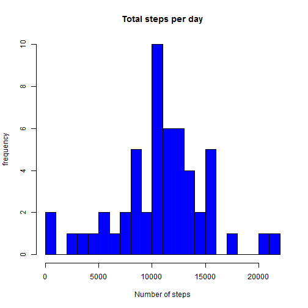
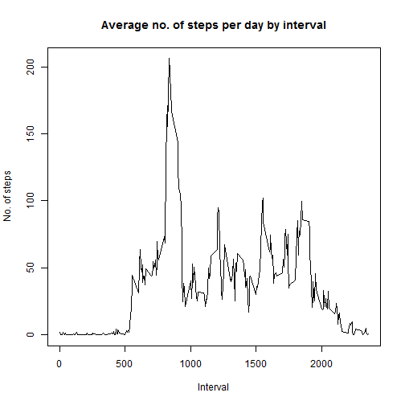
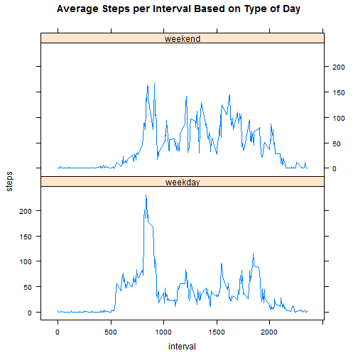

# **REPRODUCIBLE RESEARCH - PROJECT 1**
###The purpose of this project is to write a report to answer a series of questions given, using the data collected from a Fitbit.
## **Data**
### The data for this assignment can be downloaded from the course web site:

###Dataset: [Activity monitoring data [52K]](https://d396qusza40orc.cloudfront.net/repdata%2Fdata%2Factivity.zip)
###The variables included in this dataset are:

* ####steps: Number of steps taking in a 5-minute interval (missing values are coded as NA)  
* ####date: The date on which the measurement was taken in YYYY-MM-DD format  
* ####interval: Identifier for the 5-minute interval in which measurement was taken  
## **Loading and Processing Data**  

```r
library(lubridate)
```

```
## Warning: package 'lubridate' was built under R version 3.3.2
```

```
## 
## Attaching package: 'lubridate'
```

```
## The following object is masked from 'package:base':
## 
##     date
```

```r
activity <- read.csv("assignment/activity.csv",header = TRUE)

#converting date from char to date format
activity$date <- ymd(activity$date)

#getting the data without missing values
act_ign_MV <- subset(activity, !is.na(activity$steps))
```

##**What is mean total number of steps taken per day?**  
###Total number of steps taken per day  

```r
#calculating the steps taken per day
stepsbyday <- tapply(act_ign_MV$steps,act_ign_MV$date,sum,na.rm=TRUE)
stepsbyday <- stepsbyday[!is.na(stepsbyday)]

#Make a histogram
hist(x= stepsbyday,main= "Total steps per day",xlab= "Number of steps", ylab= "frequency",breaks=20,col= "blue")
```



```r
# calculate the mean and median
dailystepsMean <- mean(stepsbyday)
dailystepsMedian <- median(stepsbyday)
```

* ### The mean is 1.0766189 &times; 10<sup>4</sup>
* ### The Median is 10765

##**What is the average daily activity pattern?**

```r
# calculate the average steps for each interval
avg_int <- aggregate(steps ~ interval,act_ign_MV,mean)

#Plot the average no. of steps per day by interval
plot(avg_int$interval,avg_int$steps,type="l",xlab="Interval", ylab= "No. of steps",main= "Average no. of steps per day by interval")
```



```r
# Finding the interval with most avg steps
max_int <- avg_int[which.max(avg_int$steps),1]
```

### The most average steps are in the interval 835

##**Imputing missing values**
### 1.Calculate the missing values in the dataset

```r
missing_val <- sum(is.na(activity$steps))
```
###There are 2304 rows in the dataset.

### 2. If a 5-min interval has a missing values, we use mean for that interval
### 3. Create a new dataset that is equal to the original dataset but with the missing data filled in.

```r
# creating a new dataset which is equal to original one but with missing data
act_imputed <- activity
nas <- is.na(act_imputed$steps)

#calculate the average interval in this dataset
avg_int <- tapply(act_ign_MV$steps,act_ign_MV$interval, mean, na.rm =TRUE)

#Filling the missing values
act_imputed$steps[nas] <- avg_int[as.character(act_imputed$interval[nas])]

#calculate the steps taken per day
new_dailysteps <- tapply(act_imputed$steps,act_imputed$date,sum, na.rm= TRUE)

#Make a histogram
hist(new_dailysteps,main="Total steps each day(missing values included)",col="dark red",xlab = "No.of steps",breaks = 20)
```


```r
# compute the mean and median of the dataset 
imputed_mean <- mean(new_dailysteps)
imputed_median <- median(new_dailysteps)

#calculate the differences between two datasets
total_diff_steps <- sum(new_dailysteps)- sum(stepsbyday)
```
* ### The imputed mean is 1.0766189 &times; 10<sup>4</sup>
* ### The imputed median is 1.0766189 &times; 10<sup>4</sup>  
* ### The mean of the dataset without missing values is 1.0766189 &times; 10<sup>4</sup>
* ### The Median of the dataset without missing values is 10765
* ### From the above results the mean of two datasets remain unchanged but the median differs.
* ### Therefore there are 8.6129509 &times; 10<sup>4</sup> steps more in the imputed dataset compared to teh original dataset.

## **Are there differences in activity patterns between weekdays and weekends?**

```r
library(lattice)
#creating a variable daytype to indicate whether it is a weekday or weekend
day_type <- function(date) {
  day <- weekdays(date)
  if (day %in% c("Monday", "Tuesday", "Wednesday", "Thursday", "Friday"))
    return("weekday")
  else if (day %in% c("Saturday", "Sunday"))
    return("weekend")
  else
    stop("invalid date")
}
act_imputed$day <- sapply(act_imputed$date, day_type)

steps_int <- aggregate(steps ~ interval + day, act_imputed, mean)

# Plotting
xyplot(steps~interval|day, data = steps_int, layout=c(1,2), type ="l", main="Average Steps per Interval Based on Type of Day")
```



